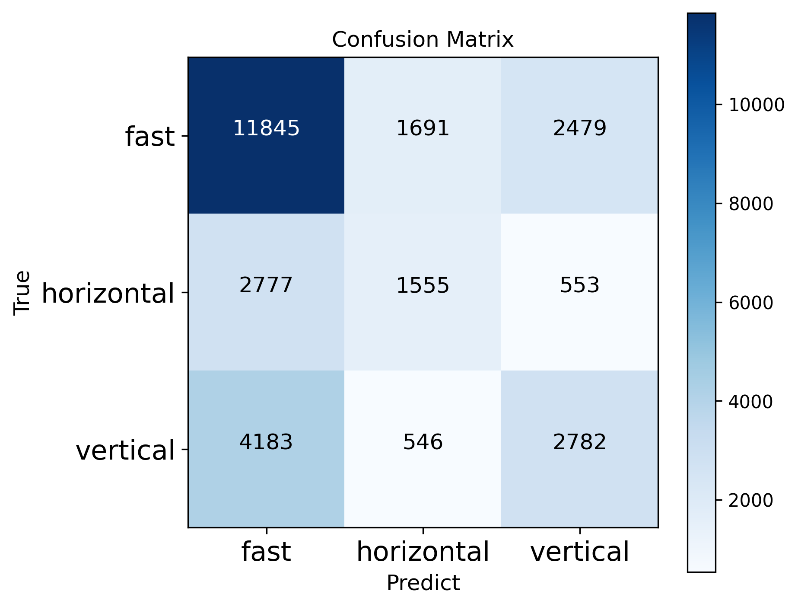

# Baseball_Recommendation

## Requirements
- python 3.6.9    
- pytorch 1.2   
- cuda 10.0
- black


## Directory
`src_baseballtransformer` : baseball transformer(ver1)

`src_baseballtransformer_pos_neg` : baseball4rec(ver2)
```
nc-xai
├── README.md
│
├── scripts
│   ├── inference_baseballtransformer.sh
│   └── train_baseballtransformer.sh.sh
│
├── src_baseballtransformer
│   ├── dataloader.py
│   ├── inference.py
│   ├── model.py
│   ├── module.py
│   ├── train.py
│   └── utils.py
│
└── src_baseballtransformer_pos_neg
    ├── scripts
    │   ├── inference.sh
    │   └── train.sh
    │
    ├── dataloader.py
    ├── inference.py
    ├── model.py
    ├── train.py
    └── utils.py
```
## 1. Baseball Transformer  

### Architecture
**Cross-modal transformer**  
  

**model architecture**  
  

### Usage
Train  
```
$ bash scripts/train_baseballtransformer.sh
```  
  
Inference
```
$ bash inference_baseballtransformer.sh
```  


### Result


**Overall**  

| Test Set(33,525) |       |
| :--------------: | :---: |
|     Macro F1     | 48.5% |
|     Micro F1     | 56.9% |
|     Bad acc      | 54.0% |
(bad_acc : Accuracy at negative situation)   


**F1 score for each ball type**  

|  Emotion   |  F1   |
| :--------: | :---: |
|    fast    | 68.0% |
| horizontal | 35.8% |
|  vertical  | 41.8% |

**Confusion matrix**  



## 2. baseballtransformer_pos_neg

### Usage
Train  
```
$ bash src_baseballtransformer_pos_neg/scripts/train.sh
There are 3 cases in train.sh
```  
  
Inference
```
$ bash src_baseballtransformer_pos_neg/scripts/inference.sh
There are 3 cases in inference.sh
```  

### Infomation
Case 1
```
Give different backprop at pitch type whether positive situation is or not(negative)
```  

Case 2
```
Transfer Learning: Positive(First) → Negative(Second)
```

Case 3
```
Positive, negative situation is added at input → expect good results at different situations
``` 
